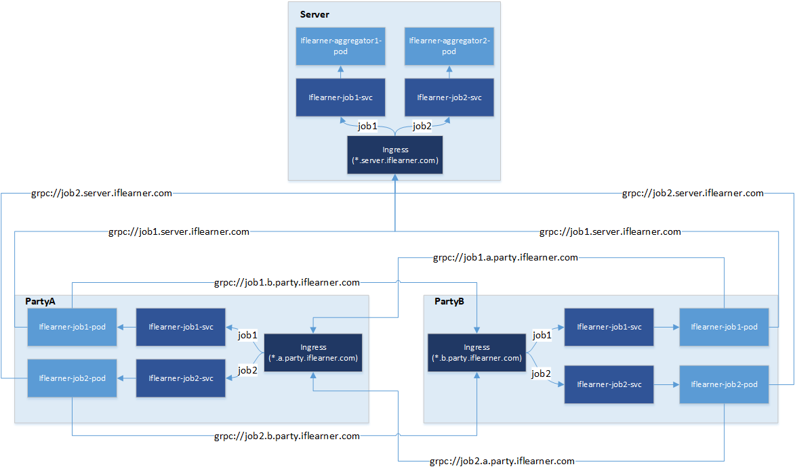

# Iflearner-Operator
Iflearner-operator is the controller of the kubernetes IflearnerJob crd.

## Description

As you known, horizontal federated learning has two roles, party and server. Iflearner-operator can create different kubernetes objects based on roles, involving ingress, service and pod. The relationship is as follows:



Between the parties and the server, we communicate using the grpc protocol and use SSL. All traffic will go to the server ingress, which will route traffic to different services based on the subdomain name. The aggregator behind the service will handle the traffic with business logic.

Between parties, we also use the same means of communication to transfer data. Of course, this is an option and the communication between parties can be ignored if not required.

## Getting Started
You need a Kubernetes cluster to run, and iflearner-operator relies on [ingress-nginx](https://github.com/kubernetes/ingress-nginx) to implement ingress. So you need to install [ingress-nginx](https://github.com/kubernetes/ingress-nginx) before starting.

### Install ingress-nginx
You can follow the [Official Installation Guide](https://kubernetes.github.io/ingress-nginx/deploy/) to install [ingress-nginx](https://github.com/kubernetes/ingress-nginx).

You can also install [ingress-nginx](https://github.com/kubernetes/ingress-nginx) as follows:

```sh
kubectl create -f ingress-nginx/deploy.yaml
```

### Install CRD
You can install CRD as follows:

```sh
bin/kustomize build config/crd | kubectl apply -f -
```

### Install controller
You can install controller as follows:

```sh
cd config/manager && ../../bin/kustomize edit set image controller=iflearner-operator:0.1.0
cd ../.. && bin/kustomize build config/default | kubectl apply -f -
```

### Create secret
We expose ingress with TLS, so we need certificate and you can create secret as follows:

```sh
kubectl create secret tls server-iflearner-secret --key server-iflearner-secret.key --cert server-iflearner-secret.crt 
kubectl create secret tls party-iflearner-secret --key party-iflearner-secret.key --cert party-iflearner-secret.crt 
```

### Create configmap
We need a certificate to connect to the ingress, so we mount the configmap into the certificate file, you can create the secret as follows:

```sh
kubectl create configmap server-iflearner-crt --from-file=ingress-nginx/server-iflearner-secret.crt
kubectl create configmap party-iflearner-crt --from-file=ingress-nginx/party-iflearner-secret.crt
```

### Configure DNS
We use domain names to connect to ingress, so you need to configure your Kubernetes DNS. If you are using the coredns component, you can configure as follows:

Firstly, you need to enter edit mode.

```sh
kubectl -n kube-system edit configmap/coredns
```

Then, you need to add some template configurations. The sever uses the domain name ***server.iflearner.com*** and the party uses the domain name ****.party.iflearner.com***.

```sh
data:
  Corefile: |
    .:53 {
        errors
        health {
           lameduck 5s
        }
        ready
        kubernetes cluster.local in-addr.arpa ip6.arpa {
           pods insecure
           fallthrough in-addr.arpa ip6.arpa
           ttl 30
        }
        prometheus :9153
        forward . /etc/resolv.conf
        cache 30
        loop
        reload
        loadbalance
        template IN A server.iflearner.com {
            match .*\.server\.iflearner\.com
            answer "{{ .Name }} 60 IN A 172.31.164.52"
            fallthrough
        }
        template IN A a.party.iflearner.com {
            match .*\.a\.party\.iflearner\.com
            answer "{{ .Name }} 60 IN A 172.31.164.53"
            fallthrough
        }
        template IN A b.party.iflearner.com {
            match .*\.b\.party\.iflearner\.com
            answer "{{ .Name }} 60 IN A 172.31.164.54"
            fallthrough
        }
    }
```

> Note: The real ip depends on your environment.


Finally, restart the coredns to make the configuration take effect.

```sh
kubectl -n kube-system rollout restart deployment coredns
```

## Uninstall
You can uninstall everything as follows:

```sh
# delete configmap
kubectl delete configmap party-iflearner-crt
kubectl delete configmap server-iflearner-crt

# delete secret
kubectl delete secret party-iflearner-secret
kubectl delete secret server-iflearner-secret

# delete controller
bin/kustomize build config/default | kubectl delete --ignore-not-found=true -f -

# delete crd
bin/kustomize build config/crd | kubectl delete --ignore-not-found=true -f -
```
